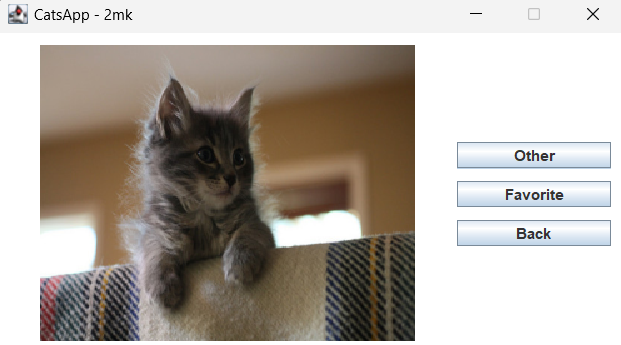
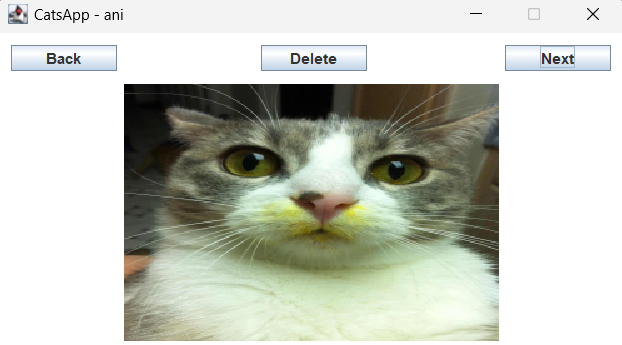

# Java SE Data Persistence Course

## 1. Elements necessary for the application

- Java `v.8`
- Maven `v.4.0.0`
- okhttp `v.4.12.0`
- gson `v.2.10.1`
- Eclipse

## 3. Environment configuration

In Eclipse you must add environment variables to run the Rest API
- Right click on the project Run As/Run Configuration/Environment/Add
- Then you need to add the api key: `variable:API_KEY_CATS value:your_api_key`.

## 4. Views

     
     

